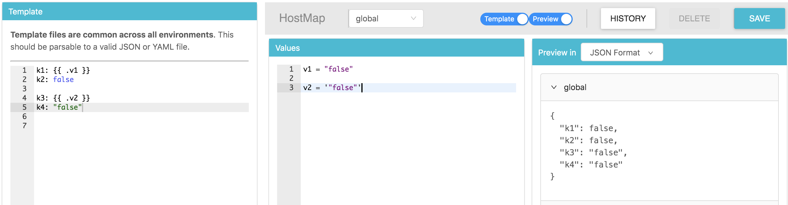
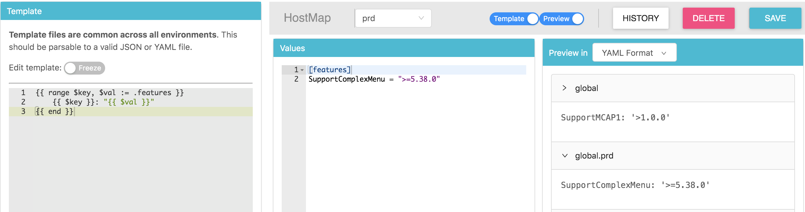
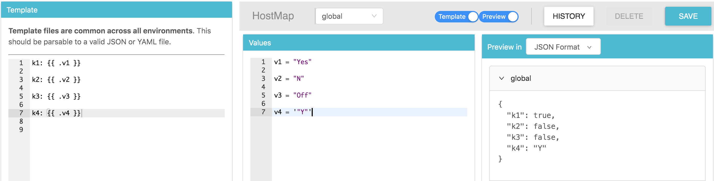
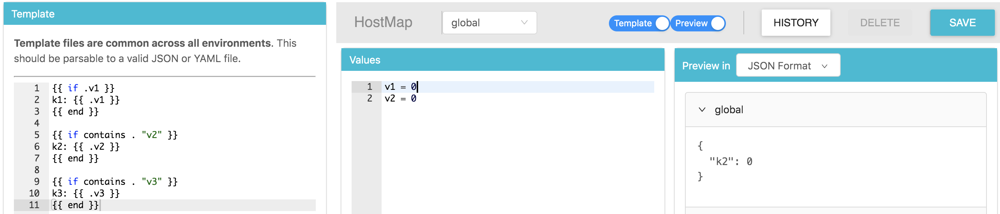
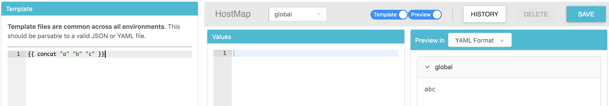
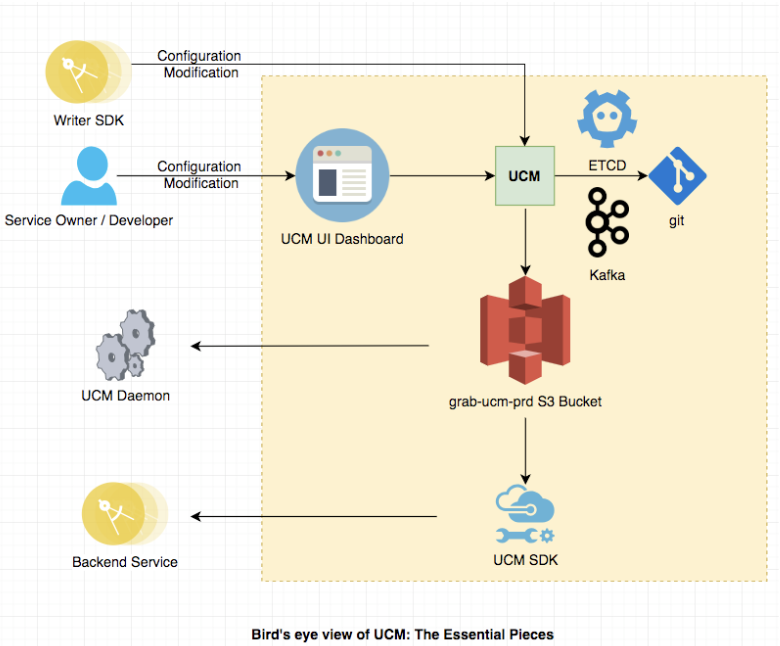

## UCM 从入门到放弃

---
### 配置中心
部署配置+应用配置

1. 多环境 参数化
1. 持久性
1. 版本控制
1. 权限
1. 日志

---
#### 多环境 参数化
- 模板：golang *text/template*，yaml 格式
- 参数：toml
- 输出：json

---
#### 多环境 参数化 —— 流程
1. 解析 toml 生成不同环境的数据（map）
1. 根据不同环境的继承关系，生成当前环境数据（按 key 覆盖）
1. 将当前环境的数据 map 填入 golang template
1. yaml 转换为 json

----
解析 toml

----
继承

----
yaml feature

---
#### 多环境 参数化 —— 自定义函数
1. 强制类型转换 int string
1. 加密 decryptWith
2. 网络相关操作

----
contains

----
concat

---
### 持久性
git 和 S3

---
### 持久性 —— git
- 每个 service 一个 git 仓库
- commit 到 git，git 改变生效之后，调用 lambda 函数更新 S3
- 修改之后未 approve 的文件也已经提交到仓库中，只是作为一个 swap 文件，所以不能同时对一个文件修改

---
### 持久性 —— S3
- S3 读写性能很高
- 提高可用性：UCM service 宕机之后，写失败，但读依然成功

---
### UCM 代码
- UCM SDK
- UCM daemon
- UCM service

---
### UCM SDK
- 轮询 S3 获取最新配置
- 复用 UCM daemon 代码

---
### UCM daemon
- 可以作为单独进程运行
- 通过 unix sock/tcp 与其他语言进程通信

---
### UCM service
- 生成配置更新到 S3
- kafka 和 etcd（write 接口）
- 内存 git
- 每次保存生成 swap 文件，触发 lambda 函数，更新 UCM 实例中的内存 git 仓库（如果两个请求同时更新一个文件，后一个在执行 git 操作时会失败）
- approve 操作是一个 git 的 move 操作

---
### 挑战
- 每个 service 对应一个 git 仓库，git 的写性能很差
- 有些 service 如 grab-x 更改频繁，并且有定时更改的需求
- UCM 支持高读吞吐量，低写吞吐量，那该如何满足高吞吐量的写需求？
- 顺序一致性

---
### UCM write 接口
- fence 用于保证只有一个生产者（etcd）
- 生产者：
    - 冲突检测：检查 hash（etcd）
    - 通过 service name 分区，将更改推送到队列（kafka）
- 消费者：缓存到内存，flush 到 git

---
### UCM write 接口
缺点：只保证最终一致性，延时高

---
### write sdk
1. 从 etcd 中获取生产者（负责处理该 service 的 UCM 实例） ip
2. 发送请求，带上前一个版本的 hash

---

